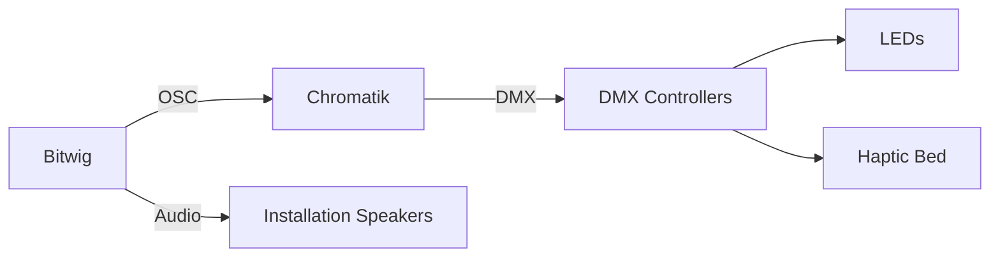

import { PortfolioPageLayout } from '@/components/PortfolioPageLayout'
import { YouTube } from '@/components/partials'
import { meta } from './meta'

<YouTube videoId="lkWg-qsuenw" />

## Layers of Translation

[George Vlad's](https://mindful-audio.com/sound-effects-libraries#/african-jungle/) field recordings capture the [Congo Basin](https://mindful-audio.com/sound-effects-libraries#/african-jungle/) and [Amazon](https://mindful-audio.com/sound-effects-libraries#/amazon-jungle/) rainforests as they sound right now — ecosystems that will likely still exist in some form, but reshaped by climate change, altered weather patterns, and human activity. These high-resolution audio captures are a timestamp of the present moment.

There were no photographs. No video. Just sound.

I listened to these recordings, imagined what the places they captured might look like, and described what I saw to generative models. The models produced their own interpretation — algorithms that render nature as light.

What visitors experience inside the Apotheneum is nature translated three times: ecosystem to recording, recording to human imagination, human imagination to machine interpretation. Each step further from the source. Each filtered through a different kind of intelligence.

## The Physical Installation

The [Apotheneum](https://www.anthonyfieldman.com/architecture#/apotheneum/) is a building-scale multi-sensory instrument — a 40×40×40 foot cubic antechamber leading into a 30-foot cylindrical inner sanctum open to the sky.

13,280 LED nodes are mounted across back-to-back nets, creating four independent canvases: the cube's exterior and interior walls, and the cylinder's exterior and interior surfaces. Each canvas can be addressed independently, layering light in ways that shift when moving through the space.

At the center sits a 24-foot hexagonal haptic bed with 96 DMX-controlled servo motors — vibration mapped to sound, translating bass frequencies and rhythmic pulses into physical sensation.

The sound system runs 4-channel surround, filling the structure from all directions.

## The Software Flow

The field recordings play through [Bitwig](https://bitwig.com), where all the tracks are laid out as arrangements with automation. That automation controls not just the audio mix but also faders, scene transitions, and effect parameters in the lighting engine — so the entire composition, sound and light, is scored in one timeline.

[Bitwig](https://bitwig.com) sends audio to the surround speakers and OSC messages to [Chromatik](https://chromatik.co/), the lighting engine. Chromatik outputs DMX to controllers that drive both the 13,280 LED nodes and the 96 servo motors in the haptic bed. When thunder rolls through the speakers, it ripples across the walls and translates into a rumbling sensation through the haptic bed.

## Treetop Transmissions: Scene by Scene

### Hyperspace — Entry

Visitors enter through a tunnel of 5,000 particles streaking past — a star field that pulls them out of the desert and into the experience. The sound is built on a modified version of Polarity's [Some Chords](https://www.youtube.com/watch?v=wzozVVbSbhE) patch. Every keypress randomly shifts the direction of travel through hyperspace and swaps the color palette. Arpeggiated keys trigger the stars to shimmer.

### Night Chorus — Nocturnal Forest

The space fills with nocturnal insects and frogs recorded deep in the Congo Basin. A moon rises, its light illuminating a forest at night. Ants appear — simulated colony pathfinding, trails of light branching and converging as they navigate the surfaces. Fireflies drift between them while binaural beats pulse through the haptic bed.

Then the scene shifts into hallucination. The trees begin to deform kaleidoscopically — 3D polar coordinate transformations warping the forest into something between a painting and a dream, alive and unstable. The moon drifts from its axis and starts to move.

### Rain — Canopy Weather

Rain begins to fall through the canopy. Frogs call from the understory — envelope followers on their sounds drive the generation, each croak triggering ripples of light that trace paths down the walls of the cylinder. A kaleidoscopic pattern fills the scene, the rain and the forest deforming together.

### Thunderstorm — Peak Drama

Thunder recorded in the Amazon drives this scene. Envelope followers on the thunder sounds trigger randomized lightning patterns that crack across all four canvases — each strike generated from a different algorithm. The haptic bed translates the low frequencies into a rumbling sensation.

### Sunrise — Resolution

The storm clears and night gives way to dawn. Birds emerge, flocking algorithms scattering across the walls. Agnes Pelton's [*Passion Flower*](https://emuseum.huntington.org/objects/56575/passion-flower) rises slowly from the bottom of the canvases, its luminous abstract forms mimicking the sunrise and gradually illuminating the scene. Then the image deforms — the polar coordinate transformations pulling it apart.

The birds continue as the scene gives way to a morning glow driven by Agnes Pelton's [*Awakening*](https://sam.nmartmuseum.org/objects/15773/awakening) — a landscape with a golden trumpet in the sky, stars at left, and purple and brown mountains whose silhouette traces the profile of her father's face. An orb pulses at the center. The background image slowly deforms and pixelates until the piece ends.

## The Patterns

Each pattern interprets a natural phenomenon from the recordings. With no visual reference, I described the behaviors and aesthetics I wanted, then implemented the generative algorithms with Claude as a coding collaborator.

### Ants — Colony Pathfinding Simulation

With no visual reference for the nocturnal forest, I started from the sounds of activity in the undergrowth. The result is a colony pathfinding simulation where ants explore the outer surface seeking a destination. Once an ant finds it, it returns home on the inner surface carrying the information. More ants join, and eventually a streaming path forms — ants flowing outward on one canvas, returning on the other.

[View source on GitHub](https://github.com/Apotheneum/Apotheneum)

### Boids — Craig Reynolds Flocking

The sunrise recordings are full of birdsong — dozens of species calling at once. The flocking algorithm is based on Craig Reynolds' boids model, where each bird follows three simple rules: separate from neighbors, align with their heading, and cohere toward the group center. The emergent behavior — murmurations that split, merge, and wheel across the canvases — comes from those three rules alone.

[View source on GitHub](https://github.com/Apotheneum/Apotheneum)

### Lightning — Randomized Strike Generation

Thunder in the Amazon recordings is enormous — long rolling cracks that fill the space. Starting from an [NVIDIA research paper on lightning rendering](https://developer.download.nvidia.com/SDK/10/direct3d/Source/Lightning/doc/lightning_doc.pdf), the implementation uses four distinct approaches: midpoint displacement, L-systems, rapidly-exploring random trees, and a physically-based model. Each thunder strike randomly selects one of the four and randomizes the parameters within that algorithm, so no two bolts look the same.

[View source on GitHub](https://github.com/Apotheneum/Apotheneum)

### Fireflies — Organic Particle System

I wanted to create the feeling of the forest being alive at night, with each firefly pulsing at its own rhythm. A dual-oscillation glow — two overlapping cycles per firefly — makes the pulses feel organic rather than mechanical. They drift across the canvases with unhurried motion.

[View source on GitHub](https://github.com/Apotheneum/Apotheneum)

### EdgeTracer — Binaural Beat Visualization

The binaural beats in the night chorus needed a visual counterpart — a geometric path tracer where lines crawl along the edges of the LED grid, tracing angular paths synced to the beat.

[View source on GitHub](https://github.com/Apotheneum/Apotheneum)

### Kaleidoscope — 3D Polar Coordinate Deformation

Kaleidoscope is a pattern I originally built for [Robot Heart](https://www.instagram.com/p/CxBfyhryObm/), where I used it extensively to render images onto screens in their art pieces — in particular [Shadybot](https://www.instagram.com/p/CxBfyhryObm/). I brought it into this project to bring static imagery alive and create dynamic morphing color effects. It takes an image and deforms it through 3D polar coordinate transformations, creating kaleidoscopic distortions that shift over time.

[View source on GitHub](https://github.com/Apotheneum/Apotheneum)

### Hyperspace — Star Field

A hyperspace effect inspired by the jump to lightspeed in Star Wars. 5,000 particles stream past with configurable orientation and direction on each of the four canvases — cube inner and outer, cylinder inner and outer. Blur effects combined with fast speed create the streaking sensation of traveling through hyperspace.

[View source on GitHub](https://github.com/Apotheneum/Apotheneum)

## Deployments

The Apotheneum was deployed in Deep Playa at Burning Man 2025, and at the Art With Me festival during Art Basel Miami in December 2025.

export default ({ children }) => <PortfolioPageLayout meta={meta}>{children}</PortfolioPageLayout>
